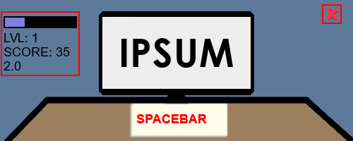
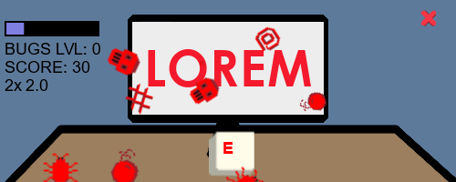

# MiniCode

You can also [read this in english](#minicode-1)

Site: https://islan42.github.io/minicode/

## SOBRE O JOGO

Minicode é um minijogo de apertar botão: você deve pressionar o botão especificado o mais rápido possível (e repetidas vezes) para completar uma barrinha e subir de nível e, no processo, marcar pontos.

Durante a criação do meu próprio web-portfólio, percebi que ele estava meio vazio já que eu não tinha construído nada muito relevante. Então pensei em construir um minigame, um projeto que não fosse muito complexo mas que pudesse quebrar o gelo e passar o tempo. Eu quase instantaneamente lembrei de um minigame que eu jogava quando criança: Em GTA SA é possível entrar numa academia e começar um minigame para levantar halteres, você pressiona um determinado botão repetidas vezes até completar uma barrinha e completar uma repetição.

Com essa inspiração comecei a viajar na ideia e planejar os aspectos da gameplay que eu queria implementar. O que mais me animou, além dos desafios que eu teria que enfrentar (tackle) para implementar tais aspectos, foi como a metalinguagem se encaixava.

Enfim, esse foi o resultado. Espero que gostem.

## ASPECTOS DA GAMEPLAY E CONTEÚDO

### BÁSICO

É um minijogo muito simples: Você pressiona **SPACEBAR** repetidas vezes, o mais rápido que conseguir, até encher a *Barrinha de Código* no canto superior esquerdo da tela. Quando você atinge o máximo da barrinha você sobe de *Nível*, o que gradativamente aumenta a dificuldade do minigame. Porém, se a barrinha chegar a zero você receberá uma marcação de *Penalidade* se ainda não tiver. Se a barrinha chegar a zero enquanto você tiver uma marcação de penalidade, será o fim do jogo.

Além disso, quando você pressiona o botão especificado um certo número de vezes, sua *Pontuação* aumenta.

Outra coisa importante é manter o ritmo. Quanto maior a frequência de clicks mantida maior o *Boost* na pontuação.

### IT'S BUGS TIME

Após um bom tempo pressionando o mesmo botão você provavelmente está entediado, mas após um tempo determinado aleatoriamente, após subir de nível, terá que enfrentar a ***HORA DOS BUGS***.

A primeira coisa a se notar é que você deve pressionar um novo botão (escolhido aleatoriamente). Também há dicas visuais para mostrar que você entrou na ***HORA DOS BUGS***, o *Boost* é dobrado e os *Penalties* são setados para 1. A boa notícia é que se você conseguir subir de nível, *Penalties* são resetados para 0, e você terá alcançado muitos pontos.

### OUTROS

- Ao atingir o *nível 10* as cores mudam para o modo noturno, pois isso é sinal de amadurecimento e profissionalismo.
- Após *subir de nível*, por alguns milésimos de segundo, ou *ao receber uma marcação de penalidade*, por alguns segundos, você fica impedido de receber uma marcação de penalidade.
- Não tente permanecer com o botão pressionado. ***NÃO VAI FUNCIONAR!***

# MiniCode

Você pode [ler isto em pt-br](#minicode)

Site: https://islan42.github.io/minicode/

## ABOUT

Minicode is a pressbutton minigame: You must press the specified button the faster you can (repeatedly) until complete a bar and level up and, score some code points.

When I was building my own web-portfolio, I noticed it lacked of content, I hasn't build nothing really interesting. So I thought about building a minigame for it, something that wouldn't be so complex, but would also be fun. Almost instantly, I remembered a GTA SA minigame I played a lot as a kid: when at the gym you could enter a minigame to lift dumbbells, you had to press a certain button repeatedly to complete a rep.

With that in mind I brainstormed about the features I would like to add to the minigame. Besides the challenges I would have to tackle, the metalanguage involved in this minigame was the thing that pushed me the most.

So, that is the result. I hope you enjoy.

## GAMEPLAY AND FEATURES

### THE BASICS

It's a very simple minigame: Press **SPACEBAR** as fast as You can, as much as You can until complete the *Coding Bar* in the top-left corner. When You do You'll *level up*, gradually increasing difficult. Pressing the *wrong key* decreases Coding Bar. Coding Bar also decreases regularly.If the Coding Bar drops to zero, though, You will receive a *Penaltie* mark, if You haven't one yet. If Coding Bar drops to zero and You have a Penalitie Mark, it's game over.

When you press the right key a certain number of times You increase your *Score*.

Maintain rhythm is important, You gain a *Boost* on your Score based on the frequency of your right presses.

### IT'S BUGS TIME

After pressing SPACEBAR for so long You'r probably bored. But after a random amount of time, afer you *level up*, You will have to face the ***BUGS TIME***.

The first thing to note is, there is a new key to press (chosed randomly). You also have visual hints to show You've entered the ***BUGS TIME***. Your *Boost* is now doubled, and *Penalties* were set to 1. The good news: when you *level up*, *Penalties* will drop to zero, and You will have a much higher Score.

### MISC

- Reaching *Lvl 10* enable dark mode, which is a signal of maturation and professionalism.
- After *lvl up*, for a few miliseconds, or after *get a penaltie*, for a few seconds, you are prevented from get a new penaltie.
- Dont even try to maintain the key pressed, ***IT WILL NOT WORK!***
